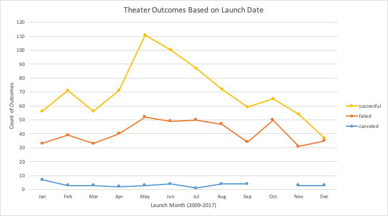

# Kickstarting with Excel

## Project Overview
This project compares the client's Kickstarter campaign for the play *Fever* with related Kickstarter campaigns. The client launched a Kickstarter campaign to raise funds for this play, and is nearly succesful in reaching the $4,000 goal.

### Purpose
Comparing the performance of the Kickstarter campaign for *Fever* with other campaigns will provide insight into how the client's campaign performed in relation to other campaigns for plays in Great Britain. This analysis will provide useful metrics for gauging the success of the *Fever* campaign while informing the launch and structure of future campaigns. 

## Analysis and Challenges

### Analysis of Outcomes Based on Launch Date
To analyze the success of Kickstarter campaigns for plays, it is crucial to find the most effective launch date. The provided Kickstarter data contained launch dates in Unix timestamp format, which was converted in Excel using this equation:
```
=(((timestamp/60)/60)/24)+DATE(1970,1,1)
```
The Unix timestamp was divided by 60 (for seconds), then 60 (for minutes), then 24 (for hours), and was then added to the Unix epoch of January 1st, 1970. This number was then converted to the date format in Excel, which appeared as:
```
Month/Day/Year Hours:Minutes
```
After filling this conversion throughout all rows in the data set, a pivot table was created to create a subset of relevant launch date information. The pivot table filtered on the parent category and years variables, with outcomes (excluding live campaigns) as the column varaible, launch date conversion as the row variable, and count of outcomes as the value. Next, the rows were grouped by month instead of date to provide optimized visualization for the best time to launch. With this information, a graph was created to visualize the outcomes of Kickstarter campaigns based on their launch date (figure 1).

### Figure 1


Figure 1 shows that May has the most successful and failed launches. Although May shows the most failed campaigns, it also shows the greatest difference between successful and failed campaigns. From 2009 to 2017, there were 111 successful campaigns launched and 52 failed campaigns in May. In contrast, there were 37 successful campaigns and 35 failed campaigns in December. With this in mind, May is the best time to launch a Kickstarter campaign for theater. 

### Analysis of Outcomes Based on Goals
Defining an appropriate goal amount is a foundational component of any Kickstarter campaign. Using the Kickstarter data on goal amounts and success rates was the most effective method for analyzing the relationship between campaign goals and outcomes. Excel's COUNTIFS function was used to algorithmically filter the outcomes based on the selected goal ranges. Below is the equation used:
```
=COUNTIFS(outcome_column, "outcome", goal_column, ">=amount_range_minimum", goal_column, "<=amount_range_maximum", subcategory_column, "plays")
```
Once the number of outcomes based on the goal range was calculated, the percentage of outcomes for each category was calculated. The percentages of outcomes provides accurate data for how well a campaign will perform based on its goal amount. Figure 2 shows the completed table that highlights the relationship between campaign outcome and goal amount for Kickstarter campaigns for plays. 

### Figure 2


