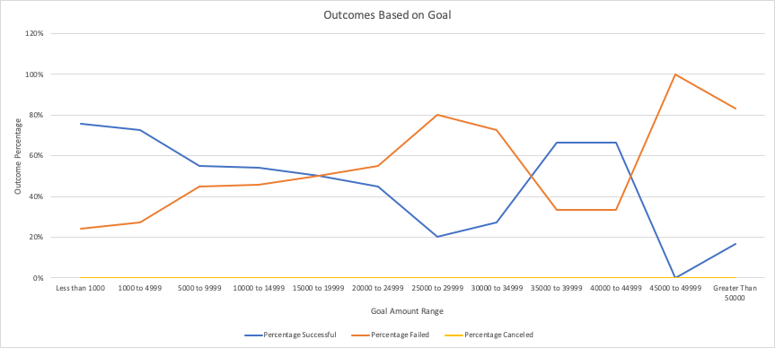

# Kickstarting with Excel

## Project Overview
This project compares the client's Kickstarter campaign for the play *Fever* with related Kickstarter campaigns. The client is very close to successfully reaching the fundraising goal, and requested a comparative analysis for the *Fever* campaign performance.

### Purpose
Comparing the performance of the Kickstarter campaign for *Fever* with other campaigns will provide insight into how the client's campaign performed in relation to other fundraising campaigns for plays. This analysis will provide useful metrics for gauging the success of the *Fever* campaign while informing the launch and structure of future campaigns. 

## Analysis and Challenges

### Analysis of Outcomes Based on Launch Date
To analyze the success of Kickstarter campaigns for plays, it is crucial to find the most effective launch date. The provided Kickstarter data contained launch dates in Unix timestamp format, which was converted in a new column in Excel using this equation:
```
=(((timestamp/60)/60)/24)+DATE(1970,1,1)
```
The Unix timestamp was divided by 60 (for seconds), then 60 (for minutes), then 24 (for hours), and was then added to the Unix epoch of January 1st, 1970. This number was then converted to the date format in Excel, which appeared as:
```
Month/Day/Year Hours:Minutes
```
After filling this conversion down the new column in the data set, a pivot table was inserted in a new worksheet to create a subset of relevant launch date information. The pivot table filtered on the parent category and years variables, with outcomes (excluding live campaigns) as the column varaible, launch date conversion as the row variable, and count of outcomes as the value. Next, the rows were grouped by month instead of date to provide optimized visualization for the best time to launch. With this information, a graph was created to visualize the outcomes of Kickstarter campaigns based on their launch date (figure 1).

### Figure 1


Figure 1 shows that May has the most successful and failed launches. Although May shows the most failed campaigns, it also shows the greatest difference between successful and failed campaigns. From 2009 to 2017, there were 111 successful campaigns launched and 52 failed campaigns in May. In contrast, there were 37 successful campaigns and 35 failed campaigns in December. With this in mind, May is the best time to launch a Kickstarter campaign for theater. 

### Analysis of Outcomes Based on Goals
Defining an appropriate goal amount is a foundational component of any Kickstarter campaign. Using the Kickstarter data on goal amounts and success rates was the most effective method for analyzing the relationship between campaign goals and outcomes. Excel's COUNTIFS function was used to algorithmically filter the outcomes based on the selected goal ranges. Below is the equation used:
```
=COUNTIFS(outcome_column, "outcome", goal_column, ">=amount_range_minimum", goal_column, "<=amount_range_maximum", subcategory_column, "plays")
```
Once the number of outcomes based on the goal range was calculated, the total amount of projects and the percentage of outcomes for each goal range was calculated. The percentages of outcomes provides accurate data for how well a campaign will perform based on its goal amount. Figure 2 shows the completed table that highlights the relationship between campaign outcome and goal amount for Kickstarter campaigns for plays. 

### Figure 2


Using the information acquired in figure 2, a line graph was created to visualize the relationship between campaign outcomes and campaign goals (figure 3).

### Figure 3


Figure 3 demonstrates that campaign goals of less than $1,000 have the highest success rate (75.81%) while goals of $1,000 to $4,999 have the second highest success rate (72.66%). Interstingly, campaign goals of $35,000 to $39,999 and $40,000 to $44,999 have the third highest success rate (66.67%). Because there were no canceled campaigns for plays, the success and failure rates mirror eachother throughout this chart. Campaign goals of more than $44,999 had the highest rate of failure. 

### Challenges and Difficulties
I encountered a challenge while creating the table shown in figure 2 that demonstrates the campaign outcome in relationship to the campaign goal range. Specifically, I was getting 0 returned for all of the COUNTIFS calculations for canceled plays, which led me to believe that my formula was wrong. After moving criteria around in the formula and calculating different iterations of the same function, I realized that there could be no canceled campaigns for plays. To investigate this idea, I opened the main data set labeled "Kickstarter", and filtered the subcategory to plays and outcomes to canceled. My hypothesis was correct, there were no canceled Kickstarter campaigns for plays. I then continued to run the COUNTIFS function down the canceled column in the table (figure 2) to be consistent in my work and to double check that my hypothesis was correct. 

## Results

The results produced from this analysis highlight several important facts about Kickstarter campaigns for plays. First, May has shown to be the best time to launch a Kickstarter campaign for theater. Campaigns launched after May tend to be gradually less successful in meeting their fundraising goals, except for a small spike in October. The data shows that December is the worst month to launch a campaign, with only 37 successful campaigns compared to 111 successful campaigns in May. It should be noted that May also has the most failed campaigns, but has the largest difference in campaigns outcomes with over twice as many successes as failures. With this in mind, it is safe to conclude that May is the best month to launch a Kickstarter campaign for theater. 

When analyzing the relationship between goal amount and outcome for plays, it became evident that certain campaign goal ranges were more likely to be successful. As expected, campaign goals of less than $1,000 had the highest success rate. This is likely due to the goal being so low that it is easily achievable. Campaign goals of $1,000 to $4,999 had the second highest rate of success. Campaign goal ranges that were higher than $4,999 showed a gradual decrease in the likelihood of being successful, except for one range. Interestingly, the $35,000 to $44,999 range had the third highest success rate. This could be due to the Kickstarter organizer's previous success or acclaimed work that brings repeat pledges from precious campaigns. Overall, the safest goal ranges to choose for Kickstarter campaigns for plays are below $1,000 and between $1,000 to $4,999. Cumulatively, the two lowest campaign goal ranges have nearly a 75% chance of being successful. 

One glaring limitation of this data set is the absence of a data dictionary. Two components that are crucial to data set information are how the data was gathered and exact definitions of variables. The presence of a data dictionary increases the accuracy of analysis while leaving little room for assumptions. Another limitation to this data set is the absence of the geographic origin of pledges. Having this information would provide greater analytical capabilities, and would not infringe on user privacy if only the country or region of origin was included. 

Visualizing the relationship between outcomes and campaign duration would be an invaluable metric to show the success of campaigns based on their length. Including this table and graph in the analysis would enhance the client's decision making capabilites by using a data-driven approach to defining the most effective campaign duration. Another graph and table that could be included is the dispersion of pledges based on location. Certain campaigns, categories, or subcategories could be more likely to garner international pledges, while others may be more localized. This information could inform decision makers on how to best market their campaigns. This information could also help define the wording and structure of their campaign description. 
